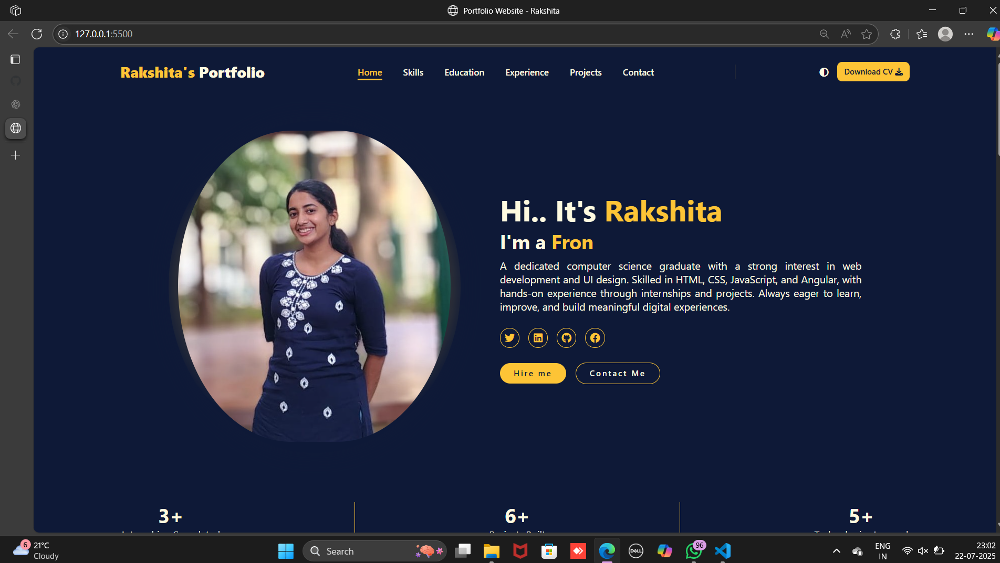
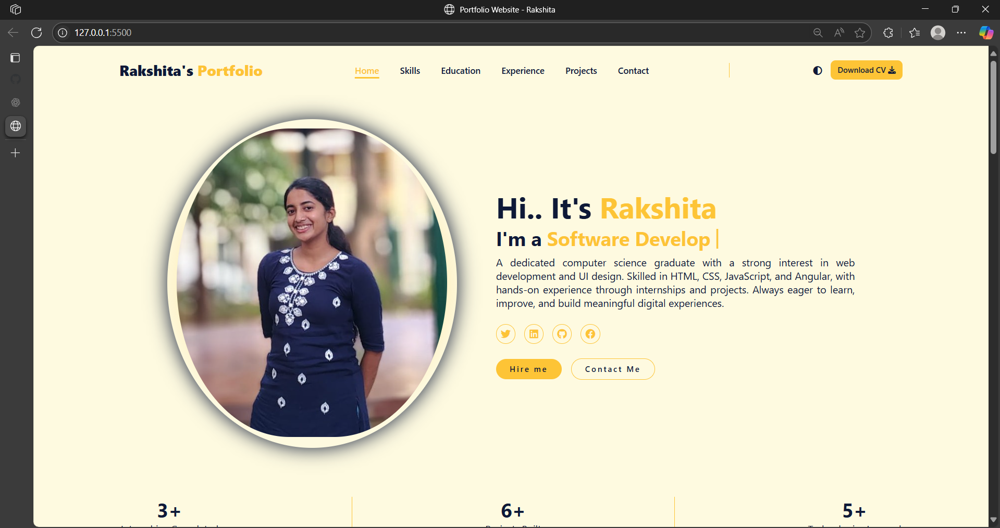

# 🌐 Personal Portfolio Website

A responsive and dynamic personal portfolio built using **HTML**, **CSS**, and **JavaScript** to showcase my skills, projects, experience, and contact information.

---

## 🔍 About

This is a **personal portfolio** designed to highlight my:

- Technical skills
- Projects
- Educational background
- Work experience
- Contact details

It includes modern UI with dark and light theme support, typing animation, and full responsiveness across devices.

---

## 🚀 Features

- 🌓 **Dark / Light Mode Toggle** with localStorage support
- ⌨️ **Typing Effect** that loops through multiple roles
- 📱 Fully **Responsive Design** (Mobile, Tablet, Desktop)
- 📁 **Project Section** with toggle to show more/less
- 🧠 **Skills**, 🎓 **Education**, 💼 **Experience**, and 📬 **Contact Form**
- ⚙️ Smooth scrolling and animated interactions
- 🧩 Clean code structure with reusable styles and components

---

## 🖼️ Screenshots

>Dark and light mode screenshot..if other check in result_screenshot 
  

---

## 🧑‍💻 Technologies Used

| Technology     | Description                  |
|----------------|------------------------------|
| HTML5          | Markup language              |
| CSS3           | Styling + Media Queries      |
| JavaScript     | Theme toggle, typing effect  |
| Git & GitHub   | Version control & hosting    |
| Font Awesome   | Icons                        |
| Google Fonts   | Custom font (Segoe UI used)  |

---
_For this, I think you all liked it⭐.  
Thank you! 😊_
